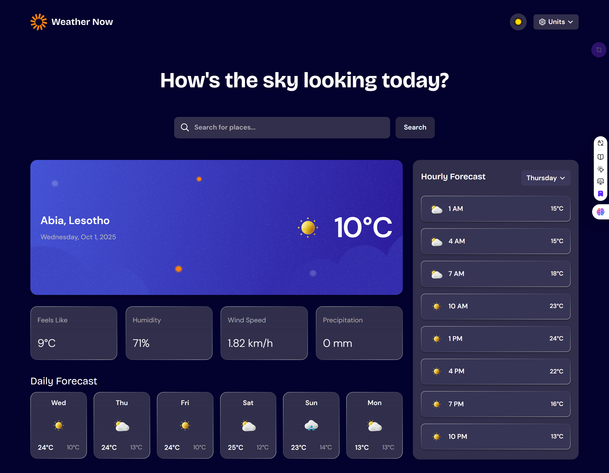

# Frontend Mentor - Weather app solution

This is a solution to the [Weather app challenge on Frontend Mentor](https://www.frontendmentor.io/challenges/weather-app-K1FhddVm49). Frontend Mentor challenges help you improve your coding skills by building realistic projects.

## Table of contents

-   [Overview](#overview)
    -   [The challenge](#the-challenge)
    -   [Screenshot](#screenshot)
    -   [Links](#links)
-   [My process](#my-process)
    -   [Built with](#built-with)
    -   [Features Documentation](#features-documentation)
    -   [What I learned](#what-i-learned)
    -   [Continued development](#continued-development)
    -   [Useful resources](#useful-resources)
-   [Author](#author)
-   [Acknowledgments](#acknowledgments)

## Overview

### The challenge

Users should be able to:

-   Search for weather information by entering a location in the search bar
-   View current weather conditions including temperature, weather icon, and location details
-   See additional weather metrics like "feels like" temperature, humidity percentage, wind speed, and precipitation amounts
-   Browse a 7-day weather forecast with daily high/low temperatures and weather icons
-   View an hourly forecast showing temperature changes throughout the day
-   Switch between different days of the week using the day selector in the hourly forecast section
-   Toggle between Imperial and Metric measurement units via the units dropdown
-   Switch between specific temperature units (Celsius and Fahrenheit) and measurement units for wind speed (km/h and mph) and precipitation (millimeters) via the units dropdown
-   View the optimal layout for the interface depending on their device's screen size
-   See hover and focus states for all interactive elements on the page

### Screenshot



### Links

-   Solution URL: [GitHub Repository](https://github.com/Nayaya-30/Weather-App)
-   Live Site URL: [Live Demo](https://weather-blush-eight.vercel.app/)

## My process

### Built with

-   Semantic HTML5 markup
-   CSS custom properties
-   Flexbox
-   CSS Grid
-   Mobile-first workflow
-   [React](https://reactjs.org/) - JS library
-   [Redux Toolkit](https://redux-toolkit.js.org/) - For state management
-   [Vite](https://vitejs.dev/) - Next generation frontend tooling
-   [SCSS](https://sass-lang.com/) - For styling
-   [Axios](https://axios-http.com/) - For API requests
-   [OpenWeatherMap API](https://openweathermap.org/api) - For weather data

### Features Documentation

#### Loading States

The application implements comprehensive loading states to enhance user experience. During API requests, users see animated loading indicators rather than static content. The loading state is managed through Redux Toolkit, with separate loading flags for weather data and forecast data. When data is being fetched, buttons become disabled and show "Searching..." text to prevent duplicate requests.

#### Redux Toolkit Implementation

The application uses Redux Toolkit for state management, which provides a robust and scalable approach to managing global state. Key aspects include:

1. **Centralized Store**: All weather data, UI preferences (theme, units), and application state are stored in a single Redux store
2. **Weather Slice**: A dedicated slice manages weather data, including current conditions and forecasts
3. **Reducers**: Pure functions handle state updates for theme toggling, unit switching, and error clearing
4. **Selectors**: Efficient data retrieval using useSelector hook to access specific parts of the state tree

#### Async Thunk for API Calls

Redux Toolkit's createAsyncThunk is used for handling asynchronous operations, specifically API calls to OpenWeatherMap:

1. **Separate Thunks**: Distinct thunks for fetching current weather and forecast data
2. **Promise Lifecycle**: Automatic handling of pending, fulfilled, and rejected states
3. **Error Handling**: Comprehensive error handling with user-friendly messages
4. **Loading State Management**: Automatic toggling of loading indicators during API requests

#### Custom Scrollbar Styling

Custom scrollbar styling enhances the UI aesthetics:

1. **Search Suggestions**: Custom scrollbars in the search suggestions dropdown
2. **Cross-browser Support**: Implementation for both WebKit browsers and Firefox
3. **Theme-aware**: Scrollbar colors adapt to light/dark themes
4. **Subtle Design**: Minimal styling that complements the overall design

#### Custom Hooks

The application utilizes custom hooks for reusable logic:

1. **useHourlyForecast**: Processes forecast data, groups by days, and manages day selection
2. **useClickOutside**: Handles click events outside components (used for closing dropdowns)
3. **Modular Logic**: Encapsulates complex logic for reusability across components

#### Component Architecture

The project follows Atomic Design principles for component organization:

1. **Atoms**: Basic building blocks (buttons, inputs, loaders)
2. **Molecules**: Combinations of atoms (search bar with suggestions)
3. **Organisms**: Complex sections (weather display, forecast panels)
4. **Templates**: Page layouts

#### Theme Toggling

Complete dark/light theme implementation:

1. **CSS Variables**: Theme-based CSS custom properties
2. **Smooth Transitions**: Animated transitions between themes
3. **Persistent Storage**: Theme preference saved in Redux store
4. **System-wide Application**: Consistent theme application across all components

#### Unit Conversion System

Comprehensive unit conversion system:

1. **Multiple Measurements**: Temperature, wind speed, and precipitation
2. **Real-time Conversion**: Instant conversion without API re-calls
3. **Dropdown Interface**: Intuitive UI for unit selection
4. **Metric/Imperial Toggling**: Quick switching between measurement systems

#### Responsive Design

Fully responsive layout that adapts to all screen sizes:

1. **Mobile-first Approach**: Base styles for mobile, enhanced for larger screens
2. **Flexible Layouts**: CSS Grid and Flexbox for adaptive components
3. **Breakpoint System**: Custom media queries for different device sizes
4. **Touch Optimization**: Larger touch targets for mobile devices

### What I learned

This project was an excellent opportunity to deepen my understanding of modern React development practices:

1. **Advanced Redux Patterns**: Learned to structure a Redux store effectively with slices and leverage createAsyncThunk for handling asynchronous operations seamlessly.

```js
export const fetchWeather = createAsyncThunk(
	'weather/fetchWeather',
	async ({ city, units }, { rejectWithValue }) => {
		try {
			const data = await fetchWeatherData(city, units);
			return data;
		} catch (error) {
			return rejectWithValue(error.message);
		}
	}
);
```

2. **Custom Hook Development**: Created reusable custom hooks like `useHourlyForecast` to encapsulate complex logic and promote code reusability.

3. **State Management Best Practices**: Implemented efficient state management patterns with proper separation of concerns between UI state and business logic.

4. **Asynchronous Data Handling**: Mastered handling asynchronous data flows, including loading states, error handling, and data caching.

5. **Component Architecture**: Applied Atomic Design principles to create a well-organized, maintainable component structure.

6. **UI/UX Enhancement Techniques**: Implemented features like loading spinners, search suggestions, and smooth transitions to create a polished user experience.

7. **Cross-browser Compatibility**: Customized scrollbars with vendor-specific prefixes and Firefox-specific properties.

8. **Performance Optimization**: Used React.memo, useMemo, and useCallback where appropriate to optimize rendering performance.

### Continued development

In future projects, I'd like to focus on:

-   Implementing more advanced animations and transitions with libraries like Framer Motion
-   Adding more detailed weather information like UV index, visibility, and atmospheric pressure
-   Creating more interactive charts for weather visualization using D3.js or Chart.js
-   Adding geolocation features to automatically detect the user's location
-   Implementing progressive web app (PWA) features for offline functionality
-   Integrating TypeScript for improved type safety
-   Adding more comprehensive unit tests with React Testing Library

### Useful resources

-   [Redux Toolkit Official Documentation](https://redux-toolkit.js.org/) - Helped me understand best practices for state management
-   [React Hooks Documentation](https://reactjs.org/docs/hooks-intro.html) - Essential resource for understanding and implementing custom hooks
-   [MDN Web Docs on CSS Scrollbars](https://developer.mozilla.org/en-US/docs/Web/CSS/CSS_scrollbars) - Helpful for implementing custom scrollbars
-   [OpenWeatherMap API Documentation](https://openweathermap.org/api) - Essential for integrating weather data

## Author

-   Frontend Mentor - [@Nayaya-30](https://www.frontendmentor.io/profile/Nayaya-30)
-   Twitter - [@usouff_](https://www.twitter.com/usouff_)

## Acknowledgments

-   Thanks to [OpenWeatherMap](https://openweathermap.org/) for providing the weather data API
-   Design inspiration from [Frontend Mentor](https://www.frontendmentor.io)
    dar
