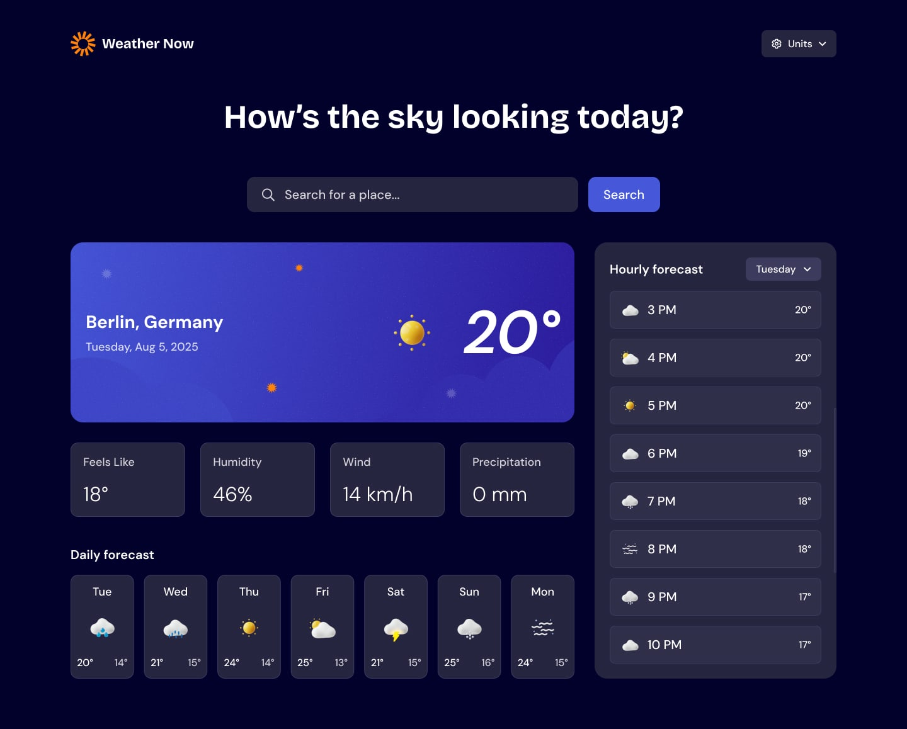

# Weather App

A beautiful, responsive weather application built with React, Redux Toolkit, and modern CSS techniques. This application allows users to search for weather information by city, view current conditions, and see a 5-day forecast.

## Table of contents

- [Overview](#overview)
  - [The challenge](#the-challenge)
  - [Screenshot](#screenshot)
  - [Links](#links)
- [My process](#my-process)
  - [Built with](#built-with)
  - [What I learned](#what-i-learned)
  - [Continued development](#continued-development)
- [Author](#author)

## Overview

### The challenge

Users should be able to:

- Search for weather information by entering a location in the search bar
- View current weather conditions including temperature, weather icon, and location details
- See additional weather metrics like "feels like" temperature, humidity percentage, and wind speed
- Browse a 5-day weather forecast with daily high/low temperatures and weather icons
- Toggle between light and dark themes
- Switch between Celsius and Fahrenheit temperature units
- View the optimal layout for the interface depending on their device's screen size
- See hover and focus states for all interactive elements on the page
- Get search suggestions for popular cities
- See loading indicators and error messages when appropriate

### Screenshot



### Links

- Solution URL: [GitHub Repository](https://github.com/your-username/weather-app)
- Live Site URL: [Live Demo](https://your-deployed-site.com)

## My process

### Built with

- Semantic HTML5 markup
- SCSS for styling with BEM methodology
- Flexbox and CSS Grid for layout
- Mobile-first workflow
- [React](https://reactjs.org/) - JS library
- [Redux Toolkit](https://redux-toolkit.js.org/) - For state management
- [Vite](https://vitejs.dev/) - Next generation frontend tooling
- [Tailwind CSS](https://tailwindcss.com/) - For responsive breakpoints
- [OpenWeatherMap API](https://openweathermap.org/api) - For weather data

### What I learned

This project helped me deepen my understanding of several key concepts:

1. **State Management with Redux Toolkit**: I learned how to structure a Redux store with slices and use createAsyncThunk for handling asynchronous operations like API calls.

```js
export const fetchWeather = createAsyncThunk(
  'weather/fetchWeather',
  async ({ city, units }, { rejectWithValue }) => {
    try {
      const data = await fetchWeatherData(city, units);
      return data;
    } catch (error) {
      return rejectWithValue(error.message);
    }
  }
);
```

2. **Component Architecture**: I implemented an atomic design approach, breaking components into atoms, molecules, and organisms for better reusability and maintainability.

3. **Theming with CSS**: I created a theme toggle feature that allows users to switch between light and dark modes, using CSS variables for consistent styling.

4. **Responsive Design**: Using Tailwind's breakpoints along with custom SCSS media queries, I ensured the app looks great on all device sizes.

5. **API Integration**: I learned how to integrate with the OpenWeatherMap API and handle various response scenarios including errors and loading states.

6. **User Experience Enhancements**: I implemented features like search suggestions, loading spinners, and user-friendly error messages to create a polished user experience.

### Beautiful Features Added

1. **Theme Toggle**: Users can switch between light and dark themes with a smooth transition
2. **Unit Toggle**: Switch between Celsius and Fahrenheit with a stylish toggle component
3. **Search Suggestions**: Get suggestions for popular cities while typing
4. **Loading Animations**: Beautiful loading spinner while data is being fetched
5. **Error Handling**: User-friendly error messages with retry functionality
6. **Responsive Design**: Fully responsive layout that works on mobile, tablet, and desktop
7. **Modern UI Components**: Clean, modern design with subtle animations and transitions

### Continued development

In future projects, I'd like to focus on:

- Implementing more advanced animations and transitions
- Adding more detailed weather information like UV index, visibility, and atmospheric pressure
- Creating more interactive charts for weather visualization
- Adding geolocation features to automatically detect the user's location
- Implementing progressive web app (PWA) features for offline functionality

## Author

- Frontend Mentor - [@yourusername](https://www.frontendmentor.io/profile/yourusername)
- Twitter - [@yourusername](https://www.twitter.com/yourusername)

## Acknowledgments

- Thanks to [OpenWeatherMap](https://openweathermap.org/) for providing the weather data API
- Design inspiration from [Frontend Mentor](https://www.frontendmentor.io)